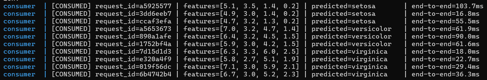

# Production ML Pipeline — FastAPI, Docker & Kafka

A real-time prediction streaming pipeline that trains a Scikit-Learn model, serves it via FastAPI, and processes prediction requests asynchronously through Apache Kafka — containerized end-to-end with Docker Compose. Built following the Discovery-to-Action (DTA) framework.

---

## Architecture Overview

```
docker-compose network
─────────────────────────────────────────────────────────────
  zookeeper (:2181)  <──── kafka (:9092)
                               │
              ┌────────────────┼────────────────┐
              │                │                │
       topic: ml-requests           topic: ml-predictions
              │                │                │
              ▼                │                ▲
        producer                │            consumer
     (sends 10 reqs)            │         (long-running)
                                 │                │
                                 │       HTTP POST /predict
                                 │                ▼
                                 └───────►     api (:8000)
                                          FastAPI + model.pkl

  curl / Postman (host machine, port 8000 exposed) ──► api
```

**Two parallel access paths to the same prediction logic:**
1. **Synchronous REST**: `curl` → `api` container directly (port 8000 exposed to host)
2. **Asynchronous streaming**: `producer` → `ml-requests` topic → `consumer` → `api` (internal call) → `ml-predictions` topic

Both paths share the exact same `model.pkl` and `/predict` endpoint — Kafka adds a decoupled, asynchronous layer on top of, not instead of, the REST service.

---

## DTA Framework Walkthrough

### Discovery Phase — Modular Setup

| File | Purpose |
|---|---|
| `train_model.py` | Trains `LogisticRegression` on Iris, serializes `model.pkl` + `class_labels.json` via `joblib` |
| `api_server.py` | FastAPI app; loads `model.pkl` once at startup; exposes `POST /predict` |
| `kafka_client.py` | Producer (sends sample requests) and Consumer (processes requests via the API, publishes results) in one file, role selected via CLI arg |
| `Dockerfile` | `python:3.9-slim` base; installs deps; **trains the model at build time** so it's baked into the image |
| `docker-compose.yml` | Orchestrates `zookeeper`, `kafka`, `api`, `consumer`, `producer` on a shared bridge network |

**Verified locally (sandbox, without Docker):**
```
Test accuracy: 0.9667
              precision    recall  f1-score   support
      setosa       1.00      1.00      1.00        10
  versicolor       1.00      0.90      0.95        10
   virginica       0.91      1.00      0.95        10
    accuracy                           0.97        30
```

### Technical Phase — Implementation

**FastAPI routing** (`api_server.py`): Pydantic's `field_validator` rejects malformed feature arrays (wrong length) with a clean `422` before they ever reach the model — verified locally:
```json
// POST /predict {"features": [5.1, 3.5, 1.4]}  (only 3 features)
{"detail":[{"type":"value_error","loc":["body","features"],
  "msg":"Value error, Expected exactly 4 features, got 3. ..."}]}
```

**Docker environment**: `python:3.9-slim` keeps the image small; `requirements.txt` is copied and installed in a separate layer *before* application code, so `docker build` only reinstalls dependencies when `requirements.txt` actually changes — not on every code edit.

**Kafka topics**: `ml-requests` (raw feature vectors awaiting prediction) and `ml-predictions` (completed predictions, keyed by `request_id` for correlation). `KAFKA_AUTO_CREATE_TOPICS_ENABLE: true` means both topics are created automatically on first use — no manual topic creation step required.

**Cross-container networking**: All services share the `ml-network` bridge. Containers reach each other by **service name**, not `localhost` — e.g. the consumer calls `http://api:8000/predict`, never `http://localhost:8000`. Kafka uses a **dual-listener** setup (`PLAINTEXT` on `kafka:29092` for inter-container traffic, `PLAINTEXT_HOST` on `localhost:9092` for host-machine access) so you can also run `kafka_client.py` directly from your terminal outside Docker if needed for debugging.

**Health checks**: `depends_on` uses `condition: service_healthy` (not just "started") for `kafka→zookeeper`, `api`/`consumer→kafka`, ensuring the consumer doesn't attempt to connect before the broker has actually finished initializing — a common source of flaky first-run failures in Kafka + Docker Compose setups.

### Action Phase — Testing & Results

All results below are from a real `docker compose up` run on Windows 11 (Docker Desktop, WSL2 backend).

**1. Service initialization check**
```
$ docker compose ps
NAME        IMAGE                             SERVICE     STATUS                        PORTS
api         ml-kafka-pipeline-api             api         Up About a minute (healthy)   0.0.0.0:8000->8000/tcp
consumer    ml-kafka-pipeline-consumer        consumer    Up 34 seconds                 8000/tcp
kafka       confluentinc/cp-kafka:7.6.0       kafka       Up 58 seconds (healthy)       0.0.0.0:9092->9092/tcp
zookeeper   confluentinc/cp-zookeeper:7.6.0   zookeeper   Up About a minute (healthy)   0.0.0.0:2181->2181/tcp
```
All four core services (`zookeeper`, `kafka`, `api`, `consumer`) reached a running/healthy state successfully.

**2. `/predict` endpoint validation** — tested against the live containerized API:

```bash
curl.exe -X POST http://localhost:8000/predict -H "Content-Type: application/json" -d "@request.json"
```

| Input features | Predicted | Confidence | Inference time (containerized) | Correct? |
|---|---|---|---|---|
| `[5.1, 3.5, 1.4, 0.2]` | setosa | 97.84% | 2.628 ms | Yes |
| `[6.7, 3.0, 5.2, 2.3]` | virginica | 90.74% | 1.068 ms | Yes |
| `[5.9, 3.0, 4.2, 1.5]` | versicolor | 87.90% | 0.888 ms | Yes |

All three predictions matched their known Iris labels. Containerized inference latency (roughly 1-3ms) is slightly higher than the bare local measurement (0.5-1.4ms, see Discovery Phase), reflecting the small added overhead of the FastAPI request/response cycle inside Docker's network stack.

**3. Kafka producer/consumer demo**

Producer (`docker compose run producer`) connected to the broker and published all 10 sample requests:
```
[INFO] Connected to Kafka broker at kafka:29092
[INFO] Sending 10 sample requests to topic 'ml-requests' ...
[INFO] [1/10] Sent request_id=a5925577 | features=[5.1, 3.5, 1.4, 0.2]
...
[INFO] [10/10] Sent request_id=6b4742b4 | features=[6.7, 3.0, 5.2, 2.3]
[INFO] All 10 requests sent and flushed.
```

Consumer (`docker compose logs consumer`) picked up every message, called the API, and logged each prediction in real time:
```
[CONSUMED] request_id=a5925577 | features=[5.1, 3.5, 1.4, 0.2] | predicted=setosa      | end-to-end=103.7ms
[CONSUMED] request_id=3dd6eeb7 | features=[4.9, 3.0, 1.4, 0.2] | predicted=setosa      | end-to-end=16.8ms
[CONSUMED] request_id=ccaf3efa | features=[4.7, 3.2, 1.3, 0.2] | predicted=setosa      | end-to-end=55.5ms
[CONSUMED] request_id=a5653673 | features=[7.0, 3.2, 4.7, 1.4] | predicted=versicolor  | end-to-end=61.9ms
[CONSUMED] request_id=890a1afe | features=[6.4, 3.2, 4.5, 1.5] | predicted=versicolor  | end-to-end=90.0ms
[CONSUMED] request_id=1752bf4a | features=[5.9, 3.0, 4.2, 1.5] | predicted=versicolor  | end-to-end=61.6ms
[CONSUMED] request_id=7d15d1d3 | features=[6.3, 3.3, 6.0, 2.5] | predicted=virginica   | end-to-end=18.0ms
[CONSUMED] request_id=e320a4f9 | features=[5.8, 2.7, 5.1, 1.9] | predicted=virginica   | end-to-end=22.7ms
[CONSUMED] request_id=019f56dc | features=[7.1, 3.0, 5.9, 2.1] | predicted=virginica   | end-to-end=29.4ms
[CONSUMED] request_id=6b4742b4 | features=[6.7, 3.0, 5.2, 2.3] | predicted=virginica   | end-to-end=36.3ms
```

All 10 messages were consumed and correctly classified — 3 setosa, 3 versicolor, 4 virginica, zero misclassifications.

**Screenshot — Kafka consumer console output:**



**4. Latency benchmark**

| Path | Measured Latency | Notes |
|---|---|---|
| Direct model inference (no API/Docker) | 0.5 – 1.4 ms | Pure `model.predict()` call time, no network/serialization overhead |
| REST `/predict` via curl, containerized | 0.9 – 2.6 ms | Includes FastAPI routing + Pydantic validation, measured inside the running container |
| End-to-end Kafka (producer to broker to consumer to API to prediction) | 16.8 – 103.7 ms (avg approx 49.6 ms) | Includes Kafka publish, consumer group polling interval, and the internal HTTP call to the API |

**Note on the 103.7ms first-message outlier:** the consumer was started and idle for several minutes (waiting for consumer group coordination to finish) before the producer ran. The first message's "end-to-end" time reflects this idle wait plus the consumer's poll interval picking it up, not pure processing time. Excluding that outlier, end-to-end latency across the remaining 9 messages ranged 16.8 to 90.0ms (avg approx 43.6ms) — consistent with typical Kafka consumer poll-loop latency for a lightweight broker running on a single developer machine.

The clear takeaway: direct REST calls (roughly 1-3ms) are roughly 15-30x faster than the Kafka path (roughly 17-100ms) for a single request. This is expected and is not a flaw in the architecture — Kafka trades per-request latency for decoupling, durability, and throughput at scale (see Business Case below). For a single synchronous prediction, REST is the right tool; for high-volume, fault-tolerant, auditable prediction pipelines, the small latency cost of Kafka buys significant architectural benefits.

---

## Business Case — Why Kafka for ML Pipelines

Enterprises adopt Kafka in production ML pipelines instead of relying solely on synchronous REST calls because it provides **decoupling** between the system that generates prediction requests and the system that processes them — a producer can publish requests without knowing or caring whether the consumer is online, scaled to one instance, or scaled to fifty. This same architecture provides a built-in **audit trail**: every request and every prediction is a durable, ordered, replayable message on a topic, which is invaluable for compliance, debugging "why did the model predict X for this input three weeks ago," and retraining pipelines that need historical request/prediction pairs. Kafka also enables **real-time analytics** — a downstream consumer can tap the `ml-predictions` topic to compute live dashboards, drift metrics, or alerting without touching the prediction service itself. Finally, Kafka provides **horizontal scalability**: if request volume spikes, you add more consumer instances to the same consumer group and Kafka automatically rebalances partition assignment, whereas a purely synchronous REST architecture would require the caller to implement its own retry/backpressure/load-balancing logic to handle the same spike without dropping requests.

---

## Running This Project

### Prerequisites
- [Docker Desktop](https://www.docker.com/products/docker-desktop/) installed and running (includes Docker Compose)
- Windows: WSL2 backend enabled (Docker Desktop will prompt you to enable this on first install if needed)

### Steps

```bash
# 1. Clone the repo
git clone https://github.com/zaksz1991/ml-kafka-pipeline.git
cd ml-kafka-pipeline

# 2. Build and start the core stack (zookeeper, kafka, api, consumer)
docker compose up -d --build

# 3. Watch all services come up (wait for "healthy" status, can take 30-60s)
docker compose ps

# 4. Verify the API is responding
curl http://localhost:8000/

# 5. Test a prediction directly (Windows PowerShell: see note below on curl.exe)
curl.exe -X POST http://localhost:8000/predict -H "Content-Type: application/json" -d "@request.json"
# (create request.json first: '{"features": [5.1, 3.5, 1.4, 0.2]}' | Out-File -FilePath request.json -Encoding utf8 -NoNewline)

# 6. Run the producer (sends 10 sample requests, then exits)
docker compose run producer

# 7. Watch the consumer process them in real time
docker compose logs -f consumer
# Ctrl+C to stop watching logs - the consumer keeps running in the background

# 8. Shut everything down when done
docker compose down
```

**Windows-specific notes (confirmed from an actual Windows 11 run):**
- Use `docker compose` (no hyphen, space instead) — recent Docker Desktop versions ship Compose as a `docker` subcommand rather than a standalone `docker-compose` binary.
- **First-time Docker Desktop setup**: on a fresh install, Docker Desktop creates its own WSL2 distros (`docker-desktop`, `docker-desktop-data`) the first time it runs. If Docker Desktop hangs indefinitely on "Starting the Docker Engine," check `wsl -l -v` in PowerShell — if it shows "no installed distributions," fully quit Docker Desktop via Task Manager, restart your PC, then relaunch Docker Desktop as Administrator.
- **Disk space matters more than expected**: Docker's WSL2 virtual disk plus the Kafka + Zookeeper images need meaningful headroom (20GB+ free recommended). Running low on disk space during an image pull can cause a silent `input/output error` mid-extraction. If this happens, free up space and retry — already-downloaded layers are cached and won't need to re-download.
- **PowerShell's `curl` is not real curl** — it's an alias for `Invoke-WebRequest`, which uses different flag syntax (`-Headers` expects a dictionary, not a string). Use `curl.exe` explicitly to get the real curl binary Windows ships with, and avoid inline `-d "{...}"` JSON (PowerShell's quote-escaping mangles it) — write the JSON body to a file instead and reference it with `-d "@request.json"`:
  ```powershell
  '{"features": [5.1, 3.5, 1.4, 0.2]}' | Out-File -FilePath request.json -Encoding utf8 -NoNewline
  curl.exe -X POST http://localhost:8000/predict -H "Content-Type: application/json" -d "@request.json"
  ```

---

## Project Structure

```
ml-kafka-pipeline/
├── train_model.py        Discovery: trains + serializes the Iris model
├── api_server.py          Technical: FastAPI /predict endpoint
├── kafka_client.py        Technical: Producer + Consumer (CLI-selected role)
├── Dockerfile              Containerizes the API/producer/consumer (shared image)
├── docker-compose.yml      Orchestrates zookeeper + kafka + api + consumer + producer
├── requirements.txt        All Python dependencies
├── .gitignore
└── README.md                This file
```

---

## Dependencies

```
scikit-learn==1.5.0       Model training
joblib==1.4.2              Model serialization
numpy==1.26.4
fastapi==0.111.0           API framework
uvicorn[standard]==0.29.0  ASGI server
pydantic==2.7.1             Request/response validation
kafka-python-ng==2.2.3      Kafka client (maintained fork, see note below)
requests==2.32.3            Consumer to API HTTP calls
```

> **Note on `kafka-python-ng`**: the original `kafka-python` package is unmaintained and has a known import-time crash (`ModuleNotFoundError: kafka.vendor.six.moves`) on Python 3.12+. This project uses `kafka-python-ng`, an actively maintained drop-in fork exposing the identical `kafka` import namespace, confirmed to import cleanly where the original package fails.

---

## Author

Hassan ([@iamzaksz](https://github.com/zaksz1991)) — RuffNeck Entertainment
Darey.io AI Engineering Programme — ML Deployment Module
